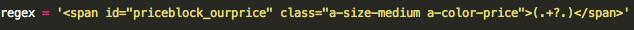

##HTML Parser

HTML Parser is a simple module to parse any website or file with any Regex you want to.

###Usage
1) 
import the module: 
<code python>
import parse.py
</code> 

2) 
Build proper regex: 
Example:  
 

3) 
Use the functions of the module 
<code>import parse</code> 
<code>print parse.fromFile("./doc.txt", yourRegex)</code> 
<code>print parse.fromUrl("amazon.com/dp/foobar", yourOtherRegex)</code>
